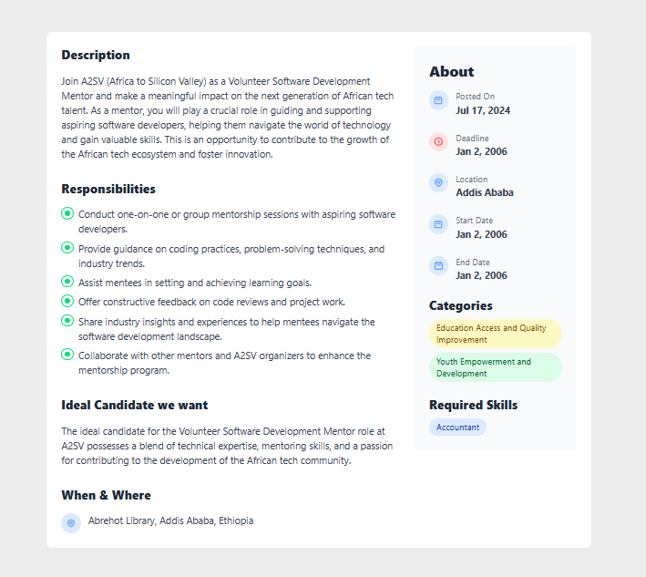

# Job Listing Application

A modern job listing application built with Next.js 15, Redux Toolkit Query, and Tailwind CSS that displays various job opportunities with detailed information and clean UI. The application integrates with a real backend API to fetch and display job listings.

## Screenshots

### Home Page (Job Listings)


_The home page displays all available job listings with sorting options. Users can sort jobs by most relevant, newest, oldest, and deadline._

### Job Details Page


_Detailed view of a specific job posting showing comprehensive information including responsibilities, requirements, and company details._

## Features

- 📋 Clean and modern UI for job listings
- 🔍 Job details view with comprehensive information
- ⚡ Fast page loads with Next.js
- 📱 Fully responsive design
- 🔄 Sort jobs by different criteria
- 🎨 Custom styled components with Tailwind CSS
- 🔌 Real-time data fetching with RTK Query
- 🚀 Efficient state management with Redux Toolkit
- 🌐 Integration with live backend API

## Tech Stack

- [Next.js 15](https://nextjs.org/) - React Framework
- [Redux Toolkit](https://redux-toolkit.js.org/) - State Management
- [RTK Query](https://redux-toolkit.js.org/rtk-query/overview) - Data Fetching & Caching
- [Tailwind CSS](https://tailwindcss.com/) - Styling
- [TypeScript](https://www.typescriptlang.org/) - Type Safety
- [React](https://reactjs.org/) - UI Library

## Getting Started

First, download the project from the link:

```bash
https://github.com/Su-sid/A2sv-2nd-year-education/tree/main/job-listing-app
```

Install the dependencies:

```bash
npm install

```

Run the development server:

```bash
npm run dev
```

Open [http://localhost:3000](http://localhost:3000) with your browser to see the result.

## Project Structure

```
job-listing-app-rtk-redux/
├── app/                    # Next.js app directory
│   ├── page.tsx           # Home page
│   └── jobs/[id]/         # Dynamic job details routes
├── components/            # React components
│   ├── jobs/             # Job-related components
│   └── ui/               # Reusable UI components
├── lib/                  # Utility functions and types
│   ├── apiTypes.ts       # API response types
│   ├── getFormatedDate.ts # Date formatting utility
│   └── getResponsibilities.ts # Responsibilities parser
├── redux/                # Redux store and slices
│   ├── store.ts          # Redux store configuration
│   ├── provider.tsx      # Redux provider for Next.js
│   └── services/         # RTK Query API services
│       └── jobsApi.ts    # Jobs API endpoints
└── public/               # Static assets
```

## Components

### JobListings

- Main component for displaying the list of jobs
- Integrates with RTK Query for data fetching
- Implements loading and error states
- Responsive grid layout

### JobDetails

- Displays comprehensive information about a specific job
- Fetches individual job data using RTK Query
- Sections for job description, responsibilities, and requirements
- Styled with custom Tailwind classes

### Card

- Reusable card component for job listings
- Displays key job information
- Implements hover effects and transitions

## API Integration

The application integrates with a real backend API using RTK Query:

- Efficient data fetching with automatic caching
- Real-time updates
- Loading and error states
- Type-safe API calls with TypeScript

## Development Tasks Completed

- [x] Created reusable Card component
- [x] Implemented job listings page
- [x] Added job details view
- [x] Applied responsive design
- [x] Integrated RTK Query for API calls
- [x] Implemented proper TypeScript types
- [x] Added loading states and error handling
- [x] Integrated with live backend API

## Contributing

Pull requests are welcome. For major changes, please open an issue first to discuss what you would like to change.

## License

[MIT](https://choosealicense.com/licenses/mit/)
