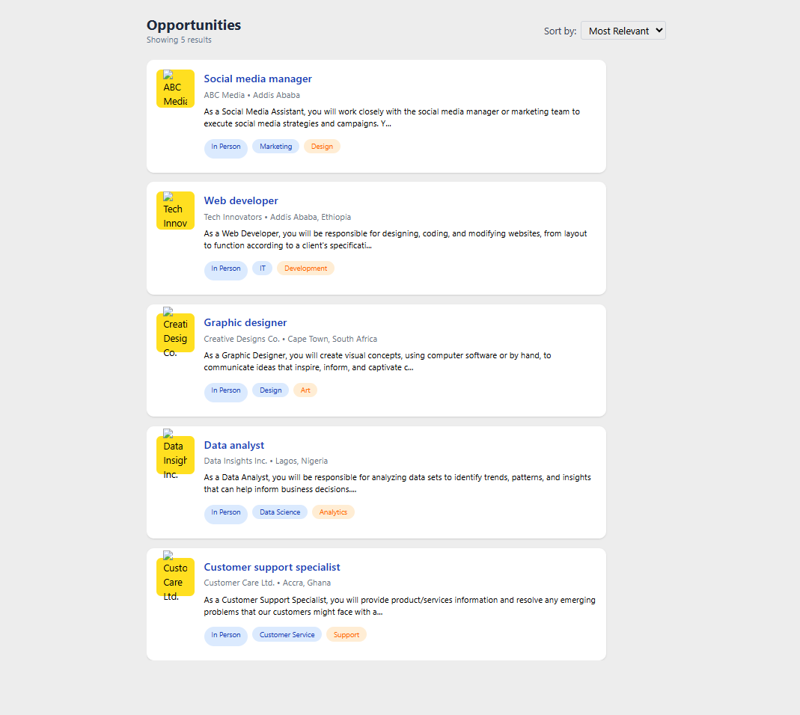
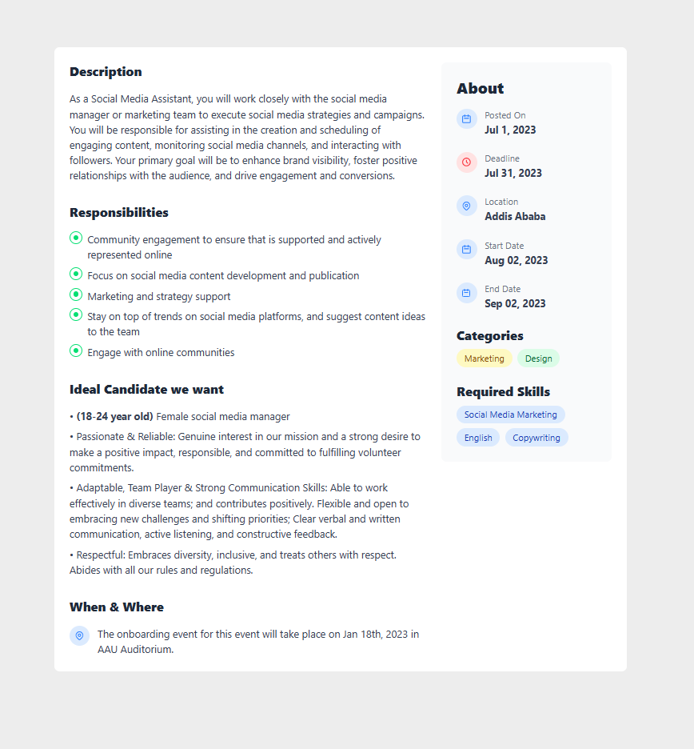

# Job Listing Application

A modern job listing application built with Next.js 15 and Tailwind CSS that displays various job opportunities with detailed information and clean UI.

## Screenshots

### Home Page (Job Listings)

*The home page displays all available job listings with sorting options. Users can sort jobs by most relevant, newest, oldest, and deadline.*

### Job Details Page

*Detailed view of a specific job posting showing comprehensive information including responsibilities, requirements, and company details.*

## Features

- 📋 Clean and modern UI for job listings
- 🔍 Job details view with comprehensive information
- ⚡ Fast page loads with Next.js
- 📱 Fully responsive design
- 🔄 Sort jobs by different criteria
- 🎨 Custom styled components with Tailwind CSS

## Tech Stack

- [Next.js 15](https://nextjs.org/) - React Framework
- [Tailwind CSS](https://tailwindcss.com/) - Styling
- [TypeScript](https://www.typescriptlang.org/) - Type Safety
- [React](https://reactjs.org/) - UI Library

## Getting Started

First, download the project from the link:

```bash
https://github.com/Su-sid/A2sv-2nd-year-education/tree/main/job-listing-app
```

Install the dependencies:

```bash
npm install

```

Run the development server:

```bash
npm run dev
```

Open [http://localhost:3000](http://localhost:3000) with your browser to see the result.

## Project Structure

```
job-listing-app/
├── app/                    # Next.js app directory
│   ├── page.tsx           # Home page
│   └── jobs/[id]/         # Dynamic job details routes
├── components/            # React components
│   ├── jobs/             # Job-related components
│   └── ui/               # Reusable UI components
├── data/                 # Static data files
├── lib/                  # types
├── public/              # Static assets

```

## Components

### JobListings
- Main component for displaying the list of jobs
- Implements sorting functionality
- Responsive grid layout

### JobDetails
- Displays comprehensive information about a specific job
- Sections for job description, responsibilities, and requirements
- Styled with custom Tailwind classes

### Card
- Reusable card component for job listings
- Displays key job information
- Implements hover effects and transitions

## Styling

The application uses Tailwind CSS for styling with custom configurations for:
- Colors
- Typography
- Spacing
- Responsive breakpoints

## Development Tasks Completed

- [x] Created reusable Card component
- [x] Implemented job listings page
- [x] Added job details view
- [x] Integrated sorting functionality
- [x] Applied responsive design
- [x] Added dummy data integration
- [x] Implemented proper TypeScript types

## Contributing

Pull requests are welcome. For major changes, please open an issue first to discuss what you would like to change.

## License

[MIT](https://choosealicense.com/licenses/mit/)