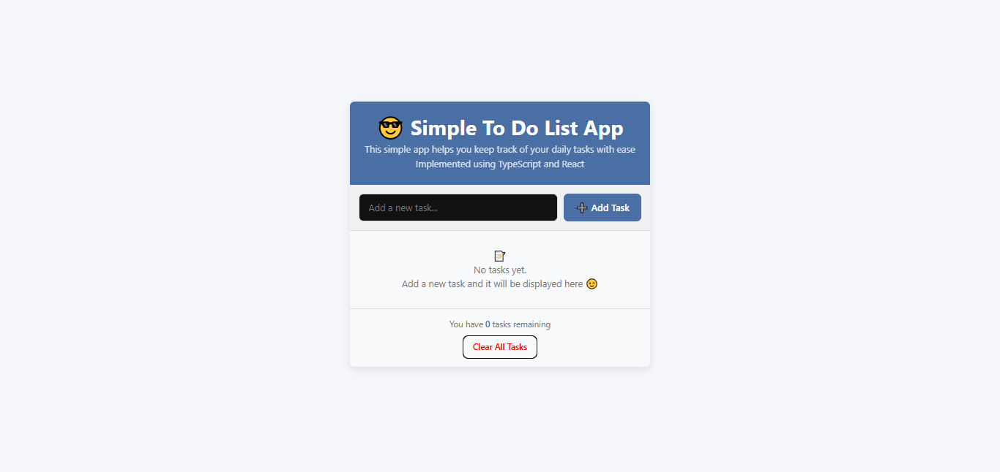
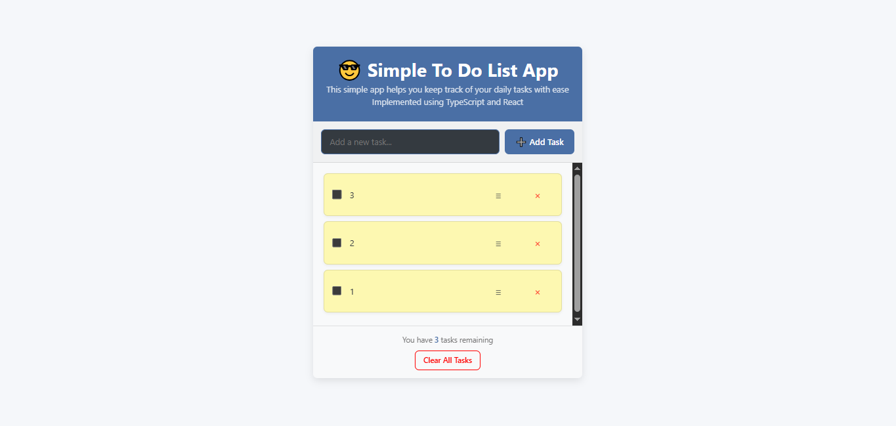

# Simple To-Do List App

An easy-to-use to-do list application built with React, TypeScript, and Vite.




## Features

- ✅ Add, edit, and delete tasks
- ✅ Mark tasks as completed
- ✅ Task counter showing remaining tasks at the bottom
- ✅ Local storage to persist tasks between sessions
- ✅ Clear all tasks with confirmation
- ✅ Clean and responsive user interface with smooth transitions
- ✅ TypeScript implementation for improved type safety and maintainability

## Project Structure

```
public/
├── todo-list-app-no-task-page.png
│── todo-list-app-with-task-page.png

src/
├── components/
│   ├── Header/
│   │   ├── Header.tsx
│   │   ├── Header.module.css
│   ├── TaskForm/
│   │   ├── TaskForm.tsx
│   │   ├── TaskForm.module.css
│   ├── NoTask/
│   │   ├── NoTask.tsx
│   │   ├── NoTask.module.css
│   ├── TaskList/
│   │   ├── TaskList.tsx
│   │   ├── TaskList.module.css
│   ├── Footer/
│   │   ├── Footer.tsx
│   │   ├── Footer.module.css
├── utils/
│   ├── localStorage.ts
├── styles/
│   ├── global.css
├── App.tsx
├── main.tsx
```

## Installation & Running the App

### Prerequisites

Ensure you have the following installed:

- [Node.js](https://nodejs.org/) (v16 or higher)
- [npm](https://www.npmjs.com/) or [yarn](https://yarnpkg.com/)

### Steps to Run the App

1. **Access and download the project files** to your machine:
   Get the files from the following repository

  ```bash
  https://github.com/Su-sid/A2sv-2nd-year-education/tree/main/todo-list-app-react-tsx

  ```

2. **Install dependencies**:

   ```bash
   npm install
   ```

3. **Start the development server**:

   ```bash
   npm run dev
   ```

4. **Open the app in your browser**:

   Visit `http://localhost:5173` to view the app.

### Building for Production

To create a production build:

```bash
npm run build
```

The build files will be generated in the `dist` folder.

### Previewing the Production Build

To preview the production build locally:

```bash
npm run preview
```

## Usage 

- **Adding Tasks**: Type your task in the input field and press "Add Task" or hit Enter.
- **Completing Tasks**: Click the checkbox next to a task to mark it as completed.
- **Editing Tasks**: Click the "≡" (edit) button to modify an existing task.
- **Deleting Tasks**: Click the "×" (delete) button to remove a specific task.
- **Clearing All**: Use the "Clear All Tasks" button at the bottom and confirm the action to remove all tasks.

## How It Works

The app uses browser local storage to save your tasks, meaning they will persist even if you close the browser or refresh the page. Tasks are stored as JSON objects with the following structure:

```typescript
interface TodoItem {
  id: string;
  text: string;
  completed: boolean;
}
```

## TypeScript Configuration

The `tsconfig.json` file configures TypeScript with the following options:

- Targets modern JavaScript (ESNext).
- Includes DOM types for browser API access.
- Enables strict type checking for better code quality.

## Browser Compatibility

This app works in all modern browsers that support ES6, TypeScript, and Local Storage:

- Chrome
- Firefox
- Safari
- Edge

## License

This project is open source and available under the [MIT License](LICENSE).
