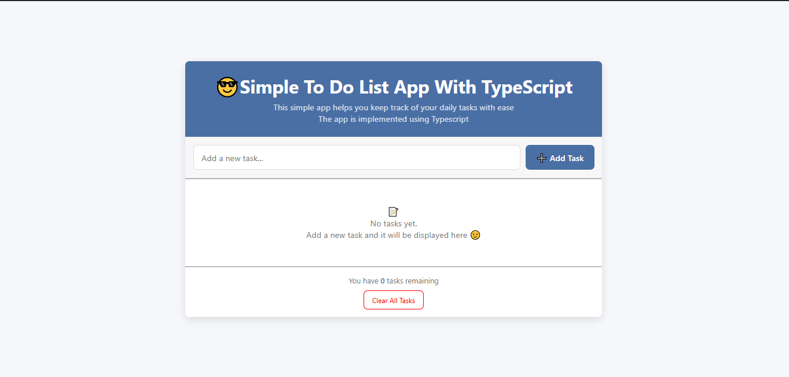
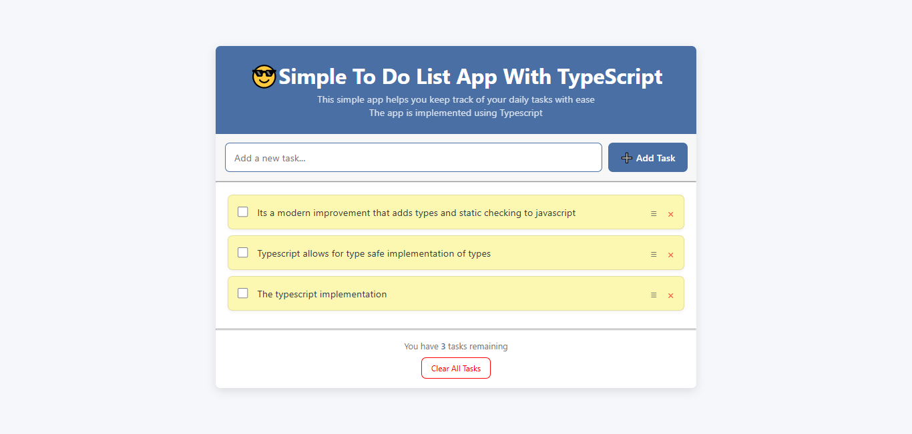

# Simple To-Do List App

An easy-to-use to-do list application built with TypeScript, HTML, and CSS.




## Features

- ✅ Add, edit, and delete tasks
- ✅ Mark tasks as completed
- ✅ Task counter showing remaining tasks at the bottom
- ✅ Local storage to persist tasks between sessions
- ✅ Clear all tasks with confirmation
- ✅ Clean and responsive user interface with smooth transitions
- ✅ TypeScript implementation for improved type safety and maintainability

## Project Structure

```
todo-list-app/
│
├── index.html
├── styles.css
├── main.js               
├── main.ts              
├── tsconfig.json         # TypeScript configuration 
├── README.md
└── ./assets             # Directory with preview images
```

## TypeScript Implementation

The app has been enhanced with TypeScript for better type safety and code organization:

- Strong typing with interfaces for Todo items
- Class-based architecture for better code organization
- Type-safe DOM manipulation
- Improved maintainability and readability

## Installation & Running the App

### Basic Installation

1. **Access and download the project files** to your local machine:
   Get the files from the following repository

```
https://github.com/Su-sid/A2sv-2nd-year-education/tree/main/todo-list-app-with-typescript
```

2. **Open the project**:

   - Open the `index.html` file in your web browser

   OR

   - Use a local development server (recommended for development):
     ```bash
     # Requires Node.js to run
     npm install -g http-server
     http-server
     ```
     Then visit `http://localhost:8080` in your browser

### TypeScript Setup and Compilation

1. **Install TypeScript from npm** 
   ```bash
   npm install -g typescript
   ```

2. **Ensure you have a tsconfig.json file** with the following content:
   ```json
   {
    "compilerOptions": {
      "target": "esnext",
      "lib": ["dom",  "es2016", "es2017"],
      "strict": true,
      "esModuleInterop": true,
      "skipLibCheck": true,
      "forceConsistentCasingInFileNames": true
    }
  }
   ```

3. **Compile TypeScript to JavaScript**:
   ```bash
   tsc
   ```

4. **Start managing your tasks!** as the app is ready.

## Usage 

- **Adding Tasks**: Type your task in the input field and press "Add Task" or hit Enter
- **Completing Tasks**: Click the checkbox next to a task to mark it as completed
- **Editing Tasks**: Click the "≡" (edit) button to modify an existing task
- **Deleting Tasks**: Click the "×" (delete) button to remove a specific task
- **Clearing All**: Use the "Clear All Tasks" button at the bottom and confirm the action to remove all tasks

## How It Works

The app uses browser local storage to save your tasks, meaning they will persist even if you close the browser or refresh the page. Tasks are stored as JSON objects with the following structure:

```typescript
interface TodoItem {
  id: string;
  text: string;
  completed: boolean;
}
```

## TypeScript Configuration

The `tsconfig.json` file configures TypeScript that:
- Targets ES6 JavaScript, which supports modern array methods like `find` and `filter`
- Includes DOM types for browser API access
- Enables strict type checking for better code quality

## Browser Compatibility

This app works in all modern browsers that support ES6, TypeScript, and Local Storage:

- Chrome
- Firefox
- Safari
- Edge

## License

This project is open source and available under the [MIT License](LICENSE).
